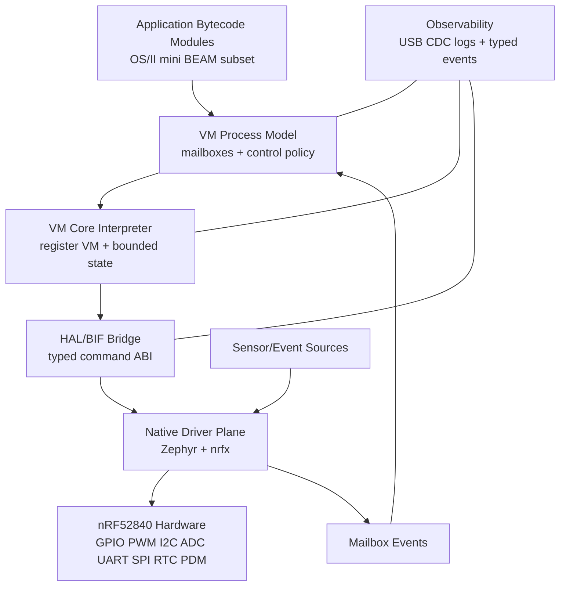

# OS/II Architecture Diagram

## Notes
- VM domain owns orchestration, retries, and mode transitions.
- Native domain owns timing-critical I/O and peripheral execution.
- Boundary is explicit through mailbox command/event contracts.
